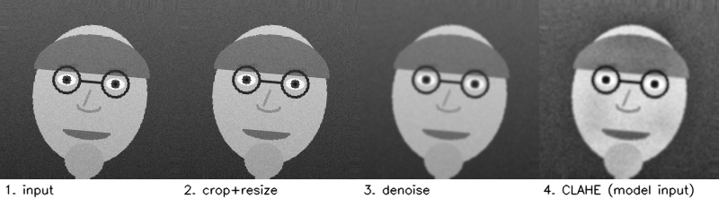
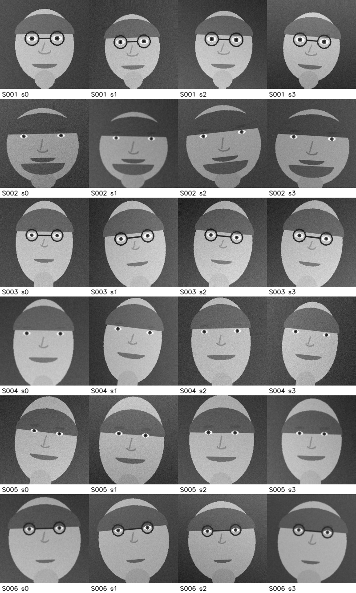

# Smart Attendance System — Face Recognition with Classical Computer Vision

A command-line attendance system that detects faces with a Haar cascade, normalises them
through an explicit pre-processing pipeline, identifies students with Local Binary Pattern
Histograms (with Eigenfaces and Fisherfaces as switchable alternatives), and records
attendance in a SQLite database with printable and exportable reports.

Everything runs on CPU with OpenCV alone — no GPU, no deep-learning framework, no network
access, and no GUI. A built-in demo generates its own dataset, so the project can be
verified end to end on a machine with no webcam and no face images.

**Course:** Computer Vision · **Submission:** VITyarthi Build Your Own Project

---

## Table of contents

1. [Features](#1-features)
2. [How it works](#2-how-it-works)
3. [Technologies used](#3-technologies-used)
4. [Installation](#4-installation)
5. [Quick start — the 60-second demo](#5-quick-start--the-60-second-demo)
6. [Using it with real faces](#6-using-it-with-real-faces)
7. [Command reference](#7-command-reference)
8. [Configuration](#8-configuration)
9. [Testing](#9-testing)
10. [Results](#10-results)
11. [Project structure](#11-project-structure)
12. [Troubleshooting](#12-troubleshooting)

---

## 1. Features

**Module 1 — Enrolment & dataset management**
Register a student from a folder of photographs, a video file, or a live camera. Each
face is detected, geometrically normalised and stored as a 200×200 chip under
`data/dataset/<id>_<name>/`. Blurred captures are rejected using the variance of the
Laplacian, so bad samples never reach the model.

**Module 2 — Recognition engine**
Haar-cascade detection → eye-based alignment → denoising → CLAHE → fixed-size resize →
LBPH / Eigenfaces / Fisherfaces classification. Every prediction returns a *distance*, and
faces beyond the rejection threshold are reported as `Unknown` instead of being forced onto
the nearest enrolled student.

**Module 3 — Attendance management & reporting**
Sessions, temporal voting (a student is marked only after N confirmations), automatic
`PRESENT` / `LATE` status, one attendance row per student per session enforced by the
database, plus console tables, per-session CSV export, and cumulative attendance
percentages.

**Module 4 — Evaluation & calibration**
Stratified train/test split, rank-1 accuracy, per-student precision/recall/F1, confusion
matrix (CSV + PNG heat-map), a distance-threshold sweep, and automatic threshold
calibration from the genuine-match distribution.

Supporting features: YAML configuration with CLI overrides, rotating log file, full audit
trail of every accepted and rejected match, 58 unit tests, and a retention helper that
purges old recognition logs.

---

## 2. How it works

```
frame ──► detect ──► crop ──► align ──► denoise ──► CLAHE ──► resize ──► LBPH ──► decision
        (Haar)              (eyes)     (Gaussian)  (contrast)  200×200          distance ≤ τ ?
```



*The same chip, after each stage of the pipeline. Training samples and live frames pass
through identical processing — this is what keeps the two distributions comparable.*

LBPH compares a pixel with its neighbours to form a binary code, builds a histogram of
those codes per grid cell, and concatenates the cells into a feature vector. Because the
codes depend on *relative* intensity, the descriptor is largely invariant to uniform
lighting changes — the main reason it is preferred here over raw-intensity methods such as
Eigenfaces.

Full design documentation, including architecture, workflow, sequence, class and ER
diagrams, is in [`docs/architecture.md`](docs/architecture.md).

---

## 3. Technologies used

| Component | Choice | Why |
|---|---|---|
| Language | Python 3.8+ | Standard for CV coursework; OpenCV bindings are first-class |
| Vision | OpenCV (`opencv-contrib-python`) | Haar cascades and `cv2.face` recognisers in one CPU-only package |
| Numerics | NumPy | Array handling for every image operation |
| Storage | SQLite (`sqlite3`, standard library) | Zero-setup relational store with constraints and foreign keys |
| Plots | matplotlib *(optional)* | Confusion-matrix heat-map |
| Config | PyYAML *(optional)* | `config.yaml`; a built-in fallback parser is used if PyYAML is absent |
| Tests | pytest | 58 unit tests, all offline |

Only `opencv-contrib-python` and `numpy` are strictly required.

---

## 4. Installation

Assumes no prior context: these steps work on a clean Linux, macOS or Windows machine with
Python 3.8 or newer and no camera.

```bash
# 1. Get the code
git clone https://github.com/SarthakTiwari3425/smart-attendance-cv.git
cd smart-attendance-cv

# 2. Create and activate a virtual environment
python3 -m venv .venv
source .venv/bin/activate          # Windows: .venv\Scripts\activate

# 3. Install dependencies
pip install --upgrade pip
pip install -r requirements.txt

# 4. Verify the installation
python main.py --version
python main.py init
```

`init` creates `data/`, `models/`, `reports/` and an empty database, then prints where each
one lives.

> **Important:** install `opencv-contrib-python`, not plain `opencv-python`. The face
> recognisers live in the `cv2.face` module, which ships only with the contrib build. If
> both are installed, uninstall both and reinstall only the contrib package.

---

## 5. Quick start — the 60-second demo

No camera and no face dataset needed:

```bash
python main.py demo
```

This one command runs the entire pipeline:

1. generates a synthetic cohort of six identities (15 enrolment samples each) plus a set of
   unlabelled "classroom camera" frames that includes one **unenrolled stranger**;
2. trains the LBPH model and auto-calibrates the rejection threshold;
3. evaluates all three algorithms on a held-out split and writes a confusion matrix;
4. runs an attendance session over the classroom frames;
5. prints the attendance report and the cumulative summary.

Expected result: all six enrolled students are marked present, and the stranger's frames
appear as rejections rather than attendance rows.

```
Algorithm | Rank-1 acc | Acc @ threshold | Threshold | Mean dist (correct) | Mean dist (wrong)
----------+------------+-----------------+-----------+---------------------+------------------
LBPH      | 95.83%     | 95.83%          | 36.0      | 29.9                | 32.0
EIGEN     | 100.00%    | 100.00%         | 6517.5    | 4128.5              | 0.0
FISHER    | 95.83%     | 91.67%          | 1401.1    | 506.4               | 1624.1

Student ID | Name        | Status  | Confidence | Marked at
-----------+-------------+---------+------------+--------------------
S001       | Asha Verma  | PRESENT | 71.8       | 2026-09-16T05:42:22
S002       | Rahul Nair  | PRESENT | 72.4       | 2026-09-16T05:42:22
...
Present: 6/6 (100.0%)

Frames | Faces | Accepted | Rejected | Newly marked
-------+-------+----------+----------+-------------
21     | 21    | 18       | 3        | 6
```

Why synthetic data? An evaluator has no webcam and may have no network access to download a
face dataset. The generator draws parametric faces with per-identity geometry and
per-sample nuisance variation (illumination gradients, sensor noise, rotation, translation,
scale, defocus) — the same nuisances a classical recogniser must survive — so the demo
exercises the real pipeline rather than a mock. Real photographs use exactly the same code
path; only the enrolment command changes.



---

## 6. Using it with real faces

```bash
# 1. Enrol each student (from a folder of photos, or from a webcam)
python main.py enroll --id S101 --name "Asha Verma" --source photos/asha
python main.py enroll --id S102 --name "Rahul Nair" --source 0 --samples 25

# 2. Train (the rejection threshold is calibrated automatically)
python main.py train

# 3. Take attendance from the classroom camera
python main.py recognize --source 0 --course CV101 --export-csv

# ... or from a recorded video / folder of stills, fully head-less
python main.py recognize --source lecture.mp4 --course CV101 --stride 5

# 4. Report
python main.py report --list-sessions
python main.py report --session CV101-20260916-0930 --csv
python main.py report --summary
```

Guidance for good accuracy: 15–25 samples per student, varied expression and head pose,
enrolment lighting similar to the classroom, and faces at least 60 px wide in the frame.
After enrolling a new cohort, always re-run `train`, then check `evaluate` before trusting
the results.

---

## 7. Command reference

| Command | What it does | Key options |
|---|---|---|
| `init` | Create folders and an empty database | — |
| `demo` | Full offline walkthrough | `--students`, `--samples`, `--keep` |
| `enroll` | Register a student's face samples | `--id`, `--name`, `--source`, `--samples`, `--display` |
| `train` | Fit the recogniser, calibrate the threshold | `--test-ratio`, `--no-calibrate` |
| `recognize` | Run an attendance session | `--source`, `--course`, `--session`, `--stride`, `--max-frames`, `--display`, `--export-csv` |
| `report` | Print / export attendance | `--session`, `--summary`, `--list-sessions`, `--csv` |
| `evaluate` | Measure accuracy and write artefacts | `--test-ratio`, `--seed`, `--compare` |
| `students` | List or remove enrolled students | `--remove <id>` |

Global options usable with any command: `--config`, `--detector {haar,none}`,
`--algorithm {lbph,eigen,fisher}`, `--threshold`, `--log-level`.

`--source` accepts a camera index (`0`), a folder of images, a single image, or a video
file. `--detector none` treats each image as an already-cropped face, which is what
pre-cropped benchmark datasets (ORL/AT&T, Yale) and the synthetic demo set need.

Every command is non-interactive and head-less; `--display` (an OpenCV preview window) is
strictly opt-in.

---

## 8. Configuration

All tunables live in [`config.yaml`](config.yaml) and can be overridden per run on the
command line. The values that matter most:

| Setting | Meaning | Typical |
|---|---|---|
| `detection.scale_factor` | Image-pyramid step; smaller finds more faces but is slower | 1.05–1.3 |
| `detection.min_neighbors` | Higher rejects more false positives | 3–8 |
| `detection.min_face_size` | Ignores distant faces | 40–100 px |
| `preprocess.denoise_ksize` | Gaussian kernel before LBP coding | 3–7 |
| `recognition.distance_threshold` | Rejection cut-off; lower is stricter | auto-calibrated |
| `attendance.consecutive_hits_required` | Confirmations before marking | 2–5 |

The threshold is the one value worth tuning per deployment. Rather than guessing, run
`python main.py evaluate` and look at `reports/evaluation.json`: the `threshold_sweep`
array lists accuracy, accept rate and false-accept rate at a range of cut-offs.

---

## 9. Testing

```bash
pip install pytest
python -m pytest tests -v
```

58 tests cover pre-processing invariants, both detector strategies, database constraints
(idempotent marking, foreign keys, cascading deletes), dataset splitting, model
save/load round-trips, threshold rejection, temporal voting, report rendering, CSV export,
configuration validation and CLI wiring. They need no camera, no network and no
pre-existing dataset — fixtures generate their own faces — and finish in about three
seconds.

```bash
python -m pytest tests -q          # 58 passed in 2.71s
```

---

## 10. Results

Measured on the bundled synthetic cohort (6 identities × 15 samples, 30 % held out,
`seed=42`) on a CPU-only machine:

| Algorithm | Rank-1 accuracy | Accuracy @ calibrated threshold | Mean genuine distance | Mean impostor distance |
|---|---|---|---|---|
| LBPH | 95.8 % | 95.8 % | 29.9 | 32.0 |
| Eigenfaces | 100 % | 100 % | 4128 | — |
| Fisherfaces | 95.8 % | 91.7 % | 506 | 1624 |

Ablation on the pre-processing chain (LBPH, same split) — measured while building the
project, and the reason the defaults are what they are:

| Configuration | Rank-1 accuracy |
|---|---|
| CLAHE + resize only | 70.8 % |
| + 3×3 Gaussian denoise | 87.5 % |
| + 5×5 Gaussian denoise *(default)* | 91.7 % |
| + 5×5 denoise, LBPH radius 2, 10×10 grid | 100 % |

Denoising matters because LBP codes come from single-pixel comparisons, so sensor noise
flips bits and corrupts the histogram. Artefacts from an evaluation run are written to
`reports/<algorithm>/`: `evaluation.json`, `confusion_matrix.csv` and
`confusion_matrix.png`. The results of the run quoted above are committed under
`reports/lbph/`, `reports/eigen/` and `reports/fisher/` so they can be inspected without
re-running anything.

These numbers characterise the synthetic benchmark, not real-world classroom accuracy;
expect lower figures on real faces, where pose and expression vary far more.

---

## 11. Project structure

```
smart-attendance-cv/
├── main.py                         # entry point: python main.py <command>
├── config.yaml                     # all tunable parameters
├── requirements.txt
├── statement.md                    # problem statement, scope, target users
├── attendance_system/
│   ├── cli.py                      # argparse sub-commands
│   ├── config.py                   # dataclass config + YAML loading
│   ├── detector.py                 # Haar cascade / passthrough strategies
│   ├── preprocessing.py            # grayscale, align, denoise, CLAHE, resize
│   ├── dataset.py                  # enrolment, loading, stratified split
│   ├── recognizer.py               # LBPH / Eigenfaces / Fisherfaces + persistence
│   ├── attendance_service.py       # session orchestration, temporal voting
│   ├── database.py                 # SQLite repository
│   ├── evaluation.py               # metrics, confusion matrix, calibration
│   ├── reporting.py                # console tables and CSV export
│   ├── video_source.py             # camera / video / image-folder sources
│   ├── synthetic.py                # procedural face generator for the demo
│   ├── logger.py                   # rotating file + console logging
│   └── exceptions.py               # error hierarchy
├── scripts/
│   ├── generate_synthetic_dataset.py
│   └── make_screenshots.py
├── tests/                          # 58 pytest tests
└── docs/
    ├── architecture.md             # design documentation + all diagrams
    ├── diagrams/                   # .mmd sources and rendered .svg
    └── images/
```

---

## 12. Troubleshooting

| Symptom | Cause and fix |
|---|---|
| `cv2.face is unavailable` | Install the contrib build: `pip uninstall -y opencv-python opencv-contrib-python && pip install opencv-contrib-python` |
| `Could not open camera 0` | No webcam, or it is in use. Use `--source <folder>` or `--source <video.mp4>` instead |
| `No trained model in models/` | Run `python main.py train` first (or `python main.py demo`) |
| `Dataset is empty` | Enrol a student, or run `python main.py demo` |
| No faces detected in your photos | Lower `detection.min_face_size`, set `scale_factor: 1.05`, or use `--detector none` if the images are already cropped faces |
| Everyone comes back as `Unknown` | The threshold is too strict — re-run `train` (it calibrates automatically) or pass `--threshold` with a larger value |
| Wrong student is matched | Too few or too similar enrolment samples. Add varied samples, re-train, and check `evaluate --compare` |
| `Fisherfaces needs at least two students` | Enrol a second student, or use `--algorithm lbph` |

---

## Licence and ethics

Released under the MIT Licence (see `LICENSE`).

Face data is biometric data. This project stores only grayscale chips and identifiers,
keeps everything local with no network calls, logs every decision for auditability, and
includes a retention helper (`purge_older_than`) to delete old recognition logs. Deploy it
only with the informed consent of the people being recognised, and note that classical
recognisers are known to perform unevenly across demographic groups — measure accuracy on
your own cohort with `evaluate` before relying on it.
