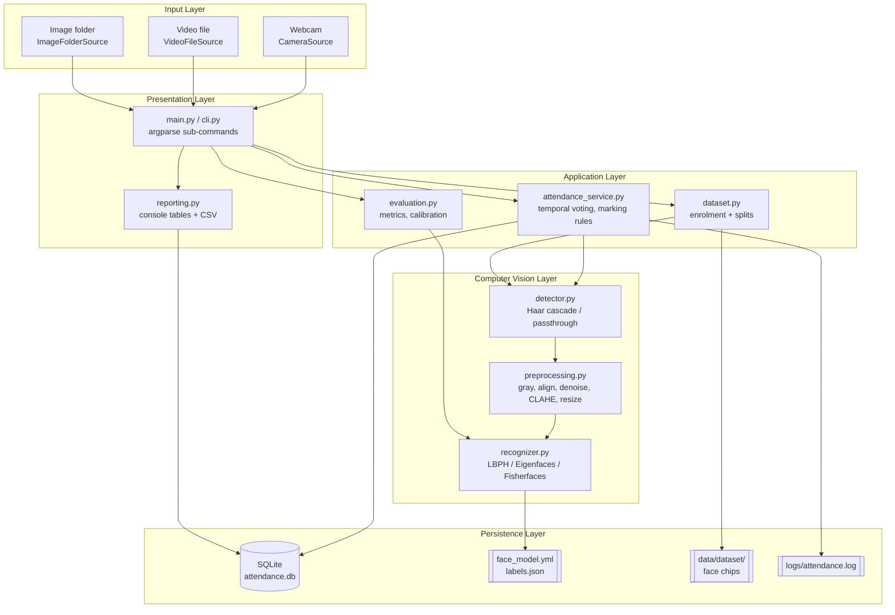
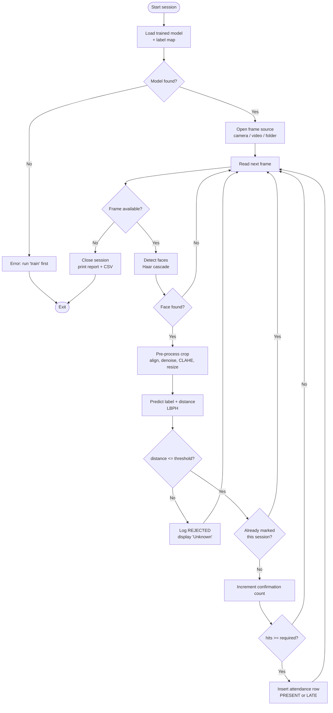
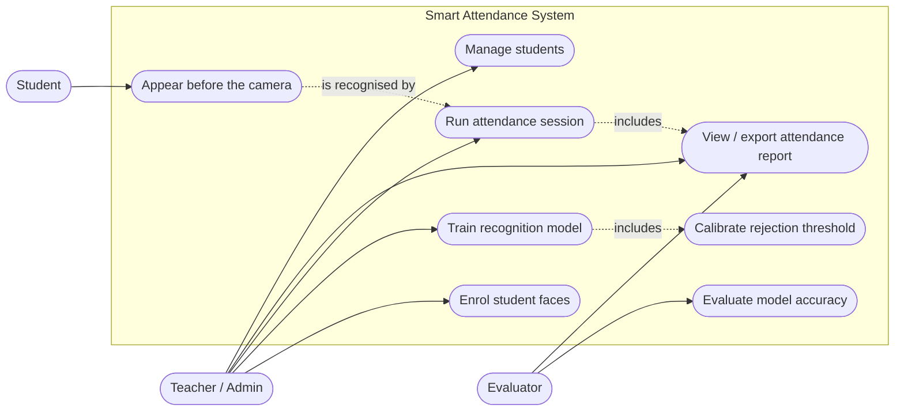
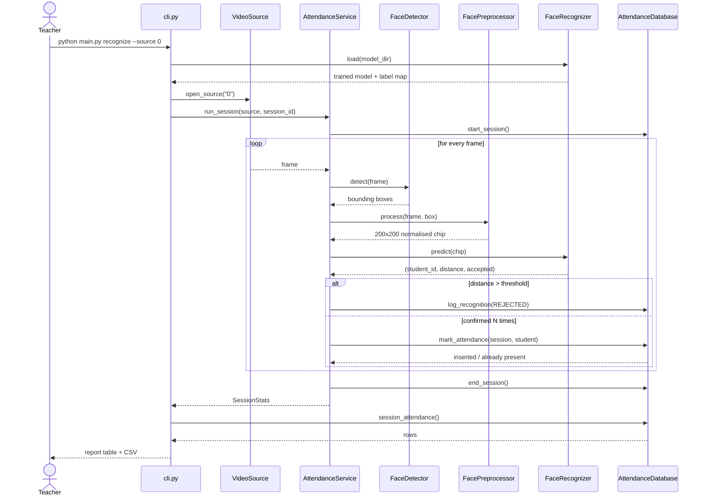
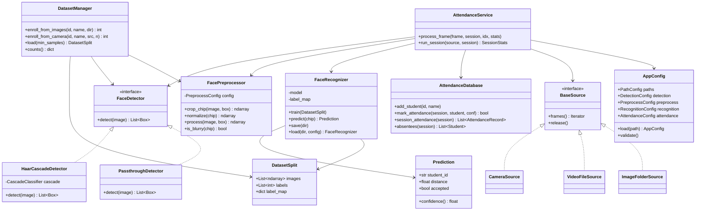
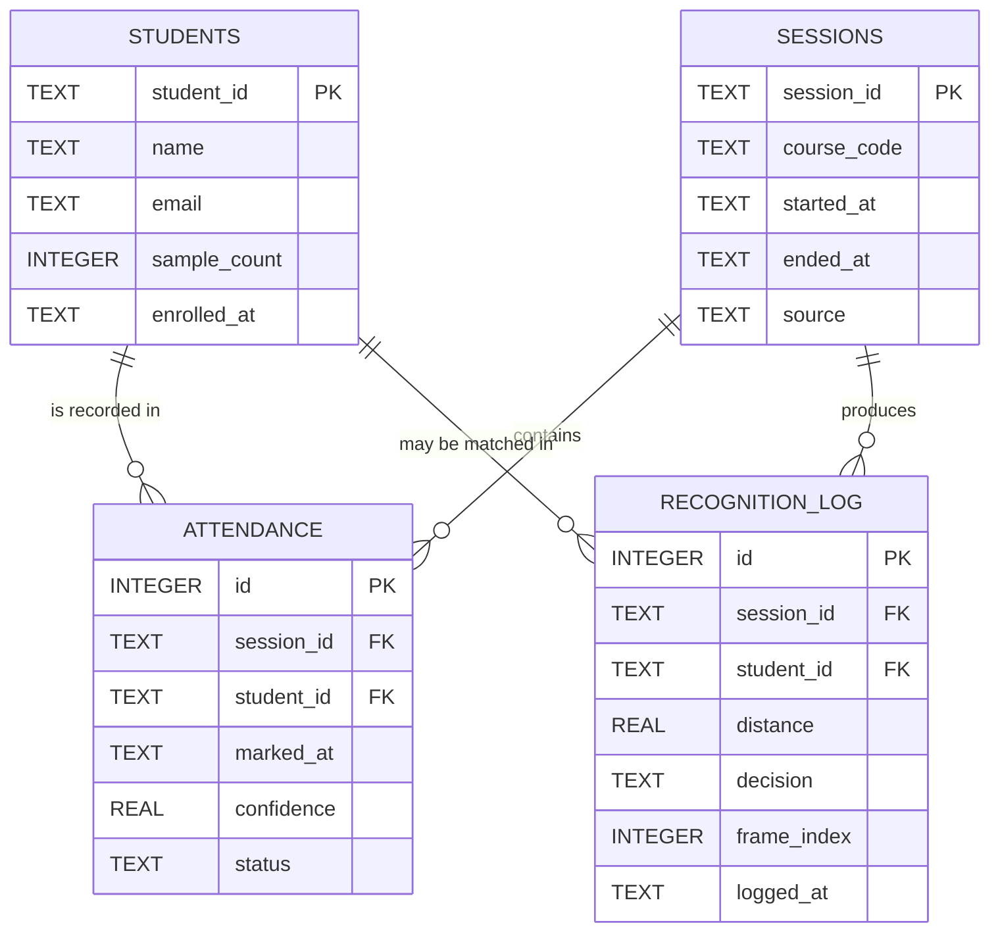

# Design Documentation

All diagrams below are written in Mermaid (GitHub renders them inline). The sources live in
`docs/diagrams/*.mmd` and rendered SVGs sit beside them for use in the project report.

---

## 1. System architecture

Five layers, each depending only on the layer beneath it. The CLI never touches OpenCV
directly and the vision layer never touches the database, which is what makes each piece
independently testable.

---

## 2. Process flow — an attendance session

The two decision diamonds that matter are the threshold check (reject unknown faces) and
the confirmation count (temporal voting). Everything else is plumbing.

---

## 3. Use case diagram

---

## 4. Sequence diagram — `recognize`

---

## 5. Class / component diagram

---

## 6. ER diagram and schema

Key constraints:

- `attendance` carries `UNIQUE(session_id, student_id)` — duplicate marking is impossible at
  the storage level, not merely discouraged in application code.
- Foreign keys are enforced (`PRAGMA foreign_keys = ON`), so attendance cannot reference a
  student who was never enrolled, and deleting a student cascades to their records.
- `recognition_log` stores **every** decision including rejections, which is what allows the
  threshold to be re-tuned after the fact from real session data.

---

## 7. Design decisions

| Decision | Alternatives considered | Why this one |
|---|---|---|
| LBPH as the default recogniser | Eigenfaces, Fisherfaces, deep embeddings (FaceNet/dlib) | LBP codes depend on *relative* pixel intensity, so they tolerate illumination change far better than PCA on raw intensity. Trains in under a second on CPU, supports incremental `update()`, and needs no pre-trained weights or network access. Eigenfaces scored higher on the synthetic benchmark, but that set has near-constant framing — exactly the condition PCA flatters. |
| Haar cascade for detection | HOG + SVM, DNN face detector (SSD/ResNet) | Ships with OpenCV, no model download, real-time on CPU. Its frontal-pose limitation is acceptable for a classroom camera facing the room. |
| Distance threshold with explicit rejection | Always take the nearest match | A nearest-neighbour classifier with no reject option will mark *someone* present for every face it sees, including a stranger. The threshold is the difference between a demo and a usable system. |
| Threshold calibrated from data | Hard-coded constant | LBPH distance scale depends on chip size, grid layout and camera. `mean + 3σ` of the genuine-match distribution transfers across datasets; a constant does not. |
| Temporal voting before marking | Mark on first match | A single frame's classification is noisy. Requiring N confirmations trades a fraction of a second for a large drop in false marks. |
| Idempotency enforced in SQL | Check-then-insert in Python | A `UNIQUE` constraint cannot be bypassed by a logic bug or a concurrent run. |
| Split preprocessing into `crop_chip` / `normalize` | One `process()` call | Stored samples keep geometric normalisation only; photometric normalisation is applied identically at training and inference time. Without this split, samples loaded from disk would be CLAHE'd twice and live frames once — a subtle train/test skew. |
| Detection as a strategy interface | `if backend == "haar"` branches | Pre-cropped benchmark datasets and unit tests need a passthrough path. The interface keeps that out of the pipeline code. |
| SQLite | CSV files, PostgreSQL | Relational constraints and transactions with zero setup; the database is a single file the evaluator can inspect. |
| Synthetic dataset generator | Ship real face images, or download ORL at runtime | Distributing real faces in a public repo is a privacy problem; downloading needs network access an evaluator may not have. Procedural faces with realistic nuisance variation exercise the same code path. |

---

## 8. Non-functional requirements

| # | Requirement | Implementation | Where |
|---|---|---|---|
| 1 | **Performance** | ~15–40 ms per frame on CPU at 200×200; `--stride` skips frames on long videos; detections capped per frame; largest faces prioritised | `detector.py`, `video_source.py` |
| 2 | **Security & privacy** | All processing local, no network calls; parameterised SQL everywhere; only grayscale chips and IDs stored; `purge_older_than()` retention helper | `database.py` |
| 3 | **Reliability** | Typed exception hierarchy; transactional writes with rollback; `KeyboardInterrupt` saves partial sessions; blur rejection screens bad samples | `exceptions.py`, `database.py`, `attendance_service.py` |
| 4 | **Usability** | Single entry point, eight sub-commands, `--help` on each; actionable error messages that name the next command to run; head-less by default | `cli.py` |
| 5 | **Maintainability** | Twelve single-responsibility modules, dataclass config with validation, 58 unit tests, docstrings throughout | project-wide |
| 6 | **Observability** | Rotating file log plus console; every accepted *and* rejected match written to `recognition_log` with its distance | `logger.py`, `database.py` |
| 7 | **Scalability** | Indexed foreign keys; incremental LBPH `update()` avoids full retraining as students are added; per-frame cost independent of cohort size except for the linear model comparison | `database.py`, `recognizer.py` |
| 8 | **Portability** | Pure CPU, two required dependencies, works on Linux/macOS/Windows, no GUI required | `requirements.txt` |

---

## 9. Testing approach

| Layer | What is tested | Examples |
|---|---|---|
| Pre-processing | Shape, dtype and invariants of each stage | fixed output size, idempotent normalisation, blur separation, crop clamping |
| Detection | Both strategies and the factory | passthrough returns the full frame, unknown backend raises, missing cascade raises |
| Dataset | Folder round-trip, loading, splitting | stratified split keeps every class in both halves, too-few-samples raises |
| Recognition | Real accuracy, not just "no exception" | ≥80 % on held-out synthetic samples, threshold rejection produces `Unknown`, model survives save/load |
| Service | Business rules | temporal voting delays marking, unknown face never marked, no duplicate rows |
| Persistence | Constraints | idempotent marking, foreign keys reject unknown students, cascade delete, retention purge |
| Reporting | Output format | table alignment, present/absent counts, CSV header and row count |
| Config & CLI | Validation and wiring | unknown key rejected, YAML round-trip, `init` and `students` exit 0 |

All 58 tests run offline in about three seconds; fixtures generate their own faces, so there
is no dependency on a camera, a network, or a pre-existing dataset.

---

## 10. Known limitations

- **No liveness detection.** A printed photograph or a phone screen held to the camera will
  be recognised. Defeating that needs blink/texture analysis or depth sensing, both out of
  scope here.
- **Frontal pose only.** Haar cascades degrade beyond roughly ±30° yaw; a student looking
  sideways will not be detected at all.
- **Accuracy figures come from synthetic data.** They characterise the benchmark, not a real
  classroom. Real faces vary far more in expression and pose; measure your own cohort with
  `evaluate` before trusting any number.
- **Each frame is classified independently.** There is no identity tracking across frames,
  which is why temporal voting is needed to compensate.
- **Demographic performance is uneven.** Classical recognisers are documented to perform
  differently across skin tones and age groups. This is a property of the method, not a bug
  to be configured away, and it is a reason to audit before deployment.
